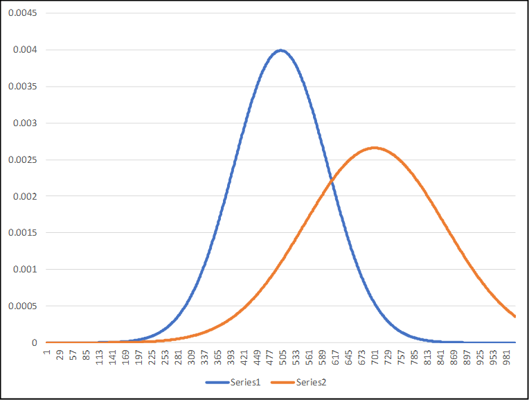
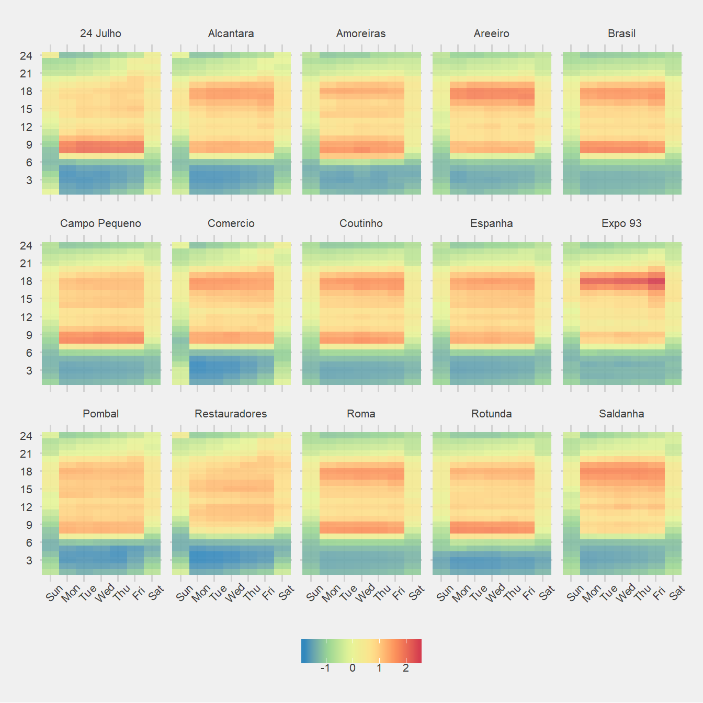
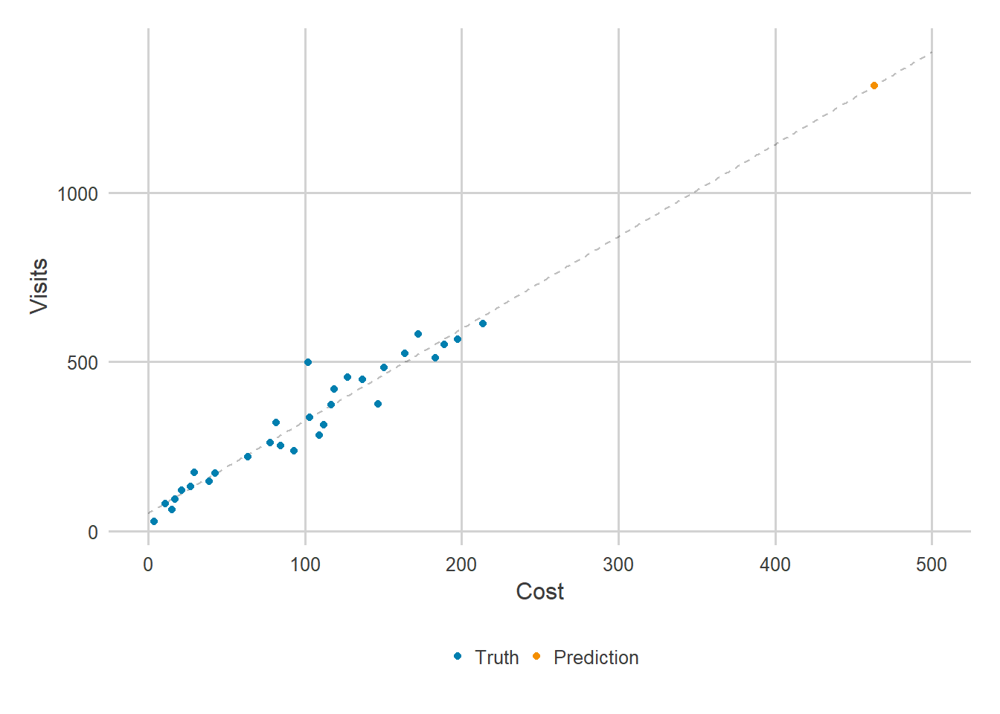
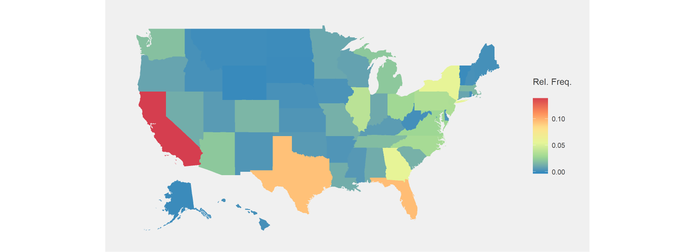

```{r setup, include=FALSE}
knitr::opts_chunk$set(echo = T)
knitr::opts_chunk$set(out.height = "90%") 
knitr::opts_chunk$set(fig.asp = 1)
knitr::opts_chunk$set(fig.align = "center")
knitr::opts_chunk$set(warning = F)
knitr::opts_chunk$set(message = F)

source("code//requirements.R")
source("code//utils.R")
```

# Motivation
<center>
  
</center>

# A Brief History of Pokémon Research
<center>
  
Image taken from: https://i.imgur.com/jHU7eZm.jpg
</center>

# Preprocess Data
## Format Columns
```{r}
#Load the data.
pokedex = read_delim("data/pokedex/pokedex.csv", ";", escape_double = FALSE, trim_ws = TRUE)
# Prepare the data.
pokedex$type1 = pokedex %>% pull(type1) %>% as.factor()
pokedex$type2 = pokedex %>% pull(type2) %>% as.factor()
pokedex$weight_kg = pokedex %>% pull(weight_kg) %>% gsub(",", ".", .) %>% as.numeric()
pokedex$height_m = pokedex %>% pull(height_m) %>% gsub(",", ".", .) %>% as.numeric()
pokedex$is_legendary = NULL
```
```{r, echo=F}
pokedex %>% 
  head(9) %>% 
  knitr::kable(col.names = c("#", "Name", "Type 1", "Type 2", "Weight (kg)", "Height (m)", "Base Total", 
                      "Attack", "Defense", "Sp. Attack", "Sp. Defense", "Speed", "Hit Points"), 
               format = "html") %>%
  kableExtra::kable_styling(bootstrap_options = c("striped", "hover", "condensed"))
```
Data taken from: https://www.kaggle.com/rounakbanik/pokemon

## Add Sprites
### Download Sprites

```{r, eval=F}
  apply(pokedex, 1, function(pokemon) {
    image_url = paste0("https://img.pokemondb.net/sprites/ruby-sapphire/normal/", pokemon['url_name'], ".png")
    file_name = paste0(pokemon['pokedex_number'], ".png")
    file_path = file.path("data", "sprites", "color", file_name)
    download.file(image_url,file_path, mode = 'wb')
  })
```

### Convert Sprites to Grayscale

```{python, eval=F, python.reticulate=F}
from PIL import Image
from os import listdir
from os.path import join

in_path = 'data/sprites/color'
out_path = 'data/sprites/grayscale'

for file in listdir(in_path):
    img = Image.open(join(in_path, file)).convert('LA')
    img.save(join(out_path, file))
```

### Add Links to Table

```{r}
# Add colored sprites.
pokedex$image_color = paste0("data//sprites//color//", pokedex$pokedex_number, ".png")
# Add gray-scaled sprites.
pokedex$image_grayscale = paste0("data//sprites//grayscale//", pokedex$pokedex_number, ".png")
```

```{r, echo=F}
pokedex %>% 
  select(pokedex_number, name, image_color, image_grayscale) %>%
  head(9) %>% 
  knitr::kable(col.names = c("#", "Name", "Image Color", "Image Grayscale"), 
               format = "html") %>%
  kableExtra::kable_styling(bootstrap_options = c("striped", "hover", "condensed"))
```

<center>
   
Sprites taken from: https://pokemondb.net/sprites
</center>


# Build Boxplot
**Research Questions:**  

- Which is the most powerful Pokémon type?  
- Which is the weakest Pokémon for each type?  
- Which is the strongest Pokémon for each type?

## Build Skeleton

```{r}
boxplot_total = ggplot(data = pokedex, aes(x = type1, y = base_total, colour = type1, fill = type1))
```

```{r, echo=F}
boxplot_total
```


## Add Geometry

```{r}
boxplot_total = boxplot_total + geom_boxplot(size = 1, alpha = 0.5)
```

```{r, echo=F}
boxplot_total
```

## Add Axis Labels

```{r}
boxplot_total = boxplot_total + labs(x = "Type 1", y = "Base Total")
```

```{r, echo=F}
boxplot_total
```

## Remove Legend

```{r}
boxplot_total = boxplot_total + theme(legend.position = "none")
```

```{r, echo=F}
boxplot_total
```

## Calculate Best and Worst Pokemon

```{r}
# Calculating best Pokemon.
t_pokemon_max = pokedex %>% group_by(type1) %>% top_n(base_total, n = 1) %>% top_n(pokedex_number, n = 1)
# Calculating worst Pokemon.
t_pokemon_min = pokedex %>% group_by(type1) %>% top_n(base_total, n = -1) %>% top_n(pokedex_number, n = 1)
# Merge best and worst Pokemon.
t_pokemon_max_min = rbind(t_pokemon_max, t_pokemon_min)
```

```{r, echo=F}
t_pokemon_max_min %>% 
  select(pokedex_number, name, type1, base_total) %>%
  knitr::kable(col.names = c("#", "Name", "Type 1", "Base Total"), 
               format = "html") %>%
  kableExtra::kable_styling(bootstrap_options = c("striped", "hover", "condensed"))
```

## Add Best and Worst Pokemon

```{r}
boxplot_total = boxplot_total + geom_image(data = t_pokemon_max_min, aes(image = image_color))
```

```{r, echo=F}
boxplot_total
```

## Calculate Order of Types

```{r}
# Calculate median base_total per type1.
t_order = pokedex %>% group_by(type1) %>% summarise(val = median(base_total)) %>% as.data.frame
# Order by median base_total in decreasing order.
t_order = t_order %>% arrange(desc(val))
```

```{r, echo=F}
t_order %>%
  knitr::kable(col.names = c("Type 1", "Median Base Total"), 
               format = "html") %>%
  kableExtra::kable_styling(bootstrap_options = c("striped", "hover", "condensed"))
```

## Add Order to Types

```{r}
boxplot_total = boxplot_total + scale_x_discrete(
  limits = t_order$type1, 
  labels = sapply(t_order$type1, function(x) capitalize(toString(x)))
  )
```
```{r, echo=F}
boxplot_total
```

## Define Color Pallete

```{r}
# Define color by type1.
color_template <- c("grass" = "#8ED752",
                    "fire" = "#F95643",
                    "water" = "#53AFFE",
                    "bug" = "#C3D221",
                    "normal" = "#BBBDAF",
                    "poison" = "#AD5CA2",
                    "electric" = "#F8E64E",
                    "ground" = "#F0CA42",
                    "fairy" = "#F9AEFE",
                    "fighting" = "#A35449",
                    "psychic" = "#FB61B4",
                    "rock" = "#CDBD72",
                    "ghost" = "#7673DA",
                    "ice" = "#66EBFF",
                    "dragon" = "#8B76FF",
                    "dark" = "#8E6856",
                    "steel" = "#C3C1D7",
                    "flying" = "#75A4F9")
# Apply color template.
boxplot_total = boxplot_total + 
  scale_fill_manual(values = color_template) + scale_colour_manual(values = color_template)
```

```{r, echo=F}
boxplot_total
```

## Define Theme

```{r}
theme_set(theme_fivethirtyeight())
```

```{r, echo=F}
boxplot_total
```

## Finalize Formatting

```{r}
boxplot_total = boxplot_total + 
  scale_y_continuous(limits = c(0, max(pokedex$base_total))) +
  coord_flip()

theme_update(
  text = element_text(size = 14),
  axis.title = element_text()
)
```

```{r, echo=F}
boxplot_total
```


## Save Plot

```{r}
ggsave(filename = "data/plot_results//box_plot.png", plot = boxplot_total, width = 10, height = 10, units = "in", dpi = 150)
```


# Scatter Plot

**Research Questions:**  

- What is the relationship between a Pokémon's attack and defense?  
- Which Pokémon are the best, in terms of attack and defense?    
- Which starter Pokémon is the best, in terms of attack and defense?  

## Get Starter Pokemon
```{r}
t_starter = pokedex %>% filter(pokedex_number <= 9)
t_non_starter = pokedex %>% filter(pokedex_number > 9)
```

### Plot Skeleton
```{r}
scatter_defense_attack = ggplot(data = t_non_starter, aes(image = image_grayscale, x = defense, y = attack)) +
  geom_image(size = 0.05) +
  geom_line(data = t_starter, aes(color = type1, group = type1), size = 1) +
  geom_image(data = t_starter, aes(image = image_color), size = 0.05)
```
```{r, echo=F}
scatter_defense_attack
```


## Adjust Labels and Remove Legend
```{r}
scatter_defense_attack = scatter_defense_attack + 
  labs(x = "Defense", y = "Attack") +
  theme(
    legend.position = "none"
  )
```
```{r, echo=F}
scatter_defense_attack
```

## Save Plot
```{r}
ggsave(filename = "data/plot_results//scatter_plot.png", plot = scatter_defense_attack, width = 10, height = 10, units = "in", dpi = 150)
```


# Build Facet Plot

**Research Questions:**  

- What is the relationship between a Pokémon's special attack and special defense, given its type 1?

## Build Skeleton
```{r}
facet_plot = ggplot(data = pokedex, aes(x = sp_defense, y = sp_attack)) +
  geom_image(aes(image = image_grayscale), size = 0.2) +
  scale_x_continuous(limits = c(0, 150)) +
  scale_y_continuous(limits = c(0, 250))
```
```{r, echo=F}
facet_plot
```

## Add Regression Line
```{r}
facet_plot = facet_plot + 
  geom_smooth(method = 'lm', se = F, aes(color = type1)) +
  scale_colour_manual(values = color_template)
```
```{r, echo=F}
facet_plot
```

## Add Facets
```{r}
facet_plot = facet_plot + facet_wrap(~type1, nrow = 3, labeller = labeller(type1 = capitalize))
```
```{r, echo=F}
facet_plot
```

## Adjust Axis Labels and Remove Legend
```{r}
facet_plot = facet_plot + 
  labs(
    x = "Special Defense",
    y = "Special Attack"
  ) +
  theme(
    legend.position = "none"
  )
```
```{r, echo=F}
facet_plot
```

## Save Plot
```{r}
ggsave(filename = "data/plot_results//facet_plot.png", plot = facet_plot, width = 10, height = 10, units = "in", dpi = 150)
```


# Build Density Plot

**Research Questions:**  

- What does the Body-Mass-Index (BMI) behave among all Pokémon?  
- Which are the Pokémon with the highest BMI?  

## Calculate BMI

```{r}
pokedex$bmi = pokedex$weight_kg / pokedex$height_m^2
```

## Build Skeleton

```{r}
density_plot = ggplot(data = pokedex, aes(x = bmi)) +
  geom_density(color = NA, fill = "Dark Grey", alpha = 0.9)
```

```{r, echo=F}
density_plot
```

## Get Pokémon with Highest BMI

```{r}
highest_bmi = pokedex %>% top_n(6, bmi) %>% arrange(bmi)
```

## Find Maximum in Density

```{r}
d_min = 0
d_max = density(pokedex %>% pull(bmi))$y %>% max()
d_start = d_max * 0.1
d_end = d_max * 0.9
d_height = d_start + 0:5 * (d_end - d_start) / 5
highest_bmi$d_height = d_height
highest_bmi$rank = paste0(highest_bmi %>% rownames() %>% rev(), ".")
```

```{r}
density_plot = density_plot +
  geom_segment(data = highest_bmi, aes(x = bmi, xend = bmi, y = 0,yend = d_height), linetype = "dashed") +
  geom_image(data = highest_bmi, aes(x = bmi, y = d_height, image = image_color), size = 0.05)
```

```{r, echo=F}
density_plot
```

```{r}
density_plot = density_plot +
  labs(x = "Body Mass Index",
       y = "Density")
```

```{r, echo=F}
density_plot
```

```{r}
gold = rgb(255, 215, 0, maxColorValue = 255)
silver = rgb(192, 192, 192, maxColorValue = 255)
bronze = rgb(205, 127, 50, maxColorValue = 255)

density_plot = density_plot +
  geom_text(data = highest_bmi, aes(x = bmi, y = d_height, label = rank, color = rank), hjust = 3) +
  scale_color_manual(values = c(gold, silver, bronze, "Black", "Black", "Black")) +
  theme(
    legend.position = "none"
  )
```

```{r, echo=F}
density_plot
```

```{r}
ggsave(filename = "data/plot_results//density_plot.png", plot = density_plot, width = 10, height = 10, units = "in", dpi = 150)
```


<!-- # Business Examples -->

<!-- <center> -->
<!--  -->
<!-- </center> -->

<!-- <center> -->
<!--  -->
<!-- </center> -->

<!-- <center> -->
<!--  -->
<!-- </center> -->


# End

*That's it, folks!*  

- Pokédex Analysis on [GitHub](https://github.com/jbj2505/pokedex_analysis)  
- Connect with me on [LinkedIn](https://www.linkedin.com/in/jan-benedikt-jagusch-84945a110/)  

<center>
  
*Easy Access to GitHub Repository*
</center>  

**Thank you,**

Jan-Benedikt Jagusch